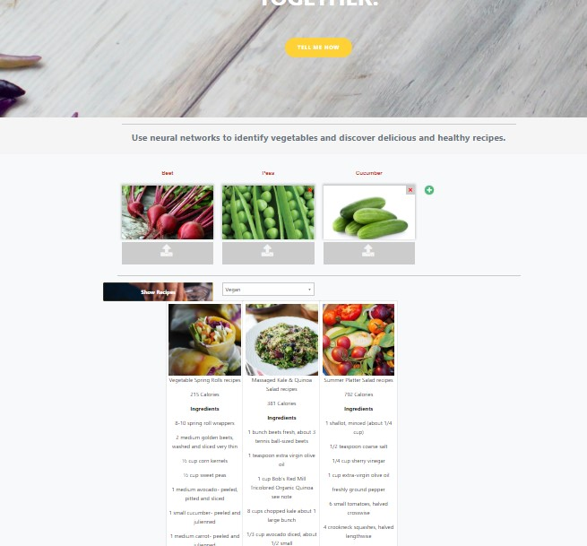

                                                          

Using deep learning for image recognition allows a computer to learn from a training data set what the important "features" of the images are. A data-driven approach of solving image classification is achieved by creating an algorithm which classifies images into specific groups. This is done by providing the algorithm with numerous examples of each image category and so trained to learn about the unique visual characteristics in each category. As an introductory project for ourselves, we chose to use a pre-trained image classifier that comes with Keras/TensorFlow (VGG19) and retrain it on our dataset. By using a hierarchy of numerous artificial neurons, the NN automatically classifies images with a higher degree of accuracy. This is one of the best examples showcasing how to train Deep Convolutional Neural Networks (DCNN) with Keras by classifying images of specific vegetable categories and outputting appropriate healthy recipe recommendations.

**Project in a nutshell**

•	Using a pre-trained image classifier with Keras/TensorFlow (ImageNet)
•	Image augmentation
•	Image classification using VGG19 Model
•	Serverless uploads with Heroku
•	Embed recipes API into application
  
  
  ## NEURAL CHEF ##  

    

                                    
 <a href="https://neural-chefs.herokuapp.com/">NeuralChef app</a>
                                         
‘NEURALCHEF’ – Our team is very much into good food and home cooking, so coming up with some idea along those lines was very appetizing for us. Ultimately it dawned on us: What can be more appealing and tempting than ‘Delectable Recipes’ which we can make at the comfort of our home with the ingredients we have on hands!! For any recipe to be tantalizing, the basic ingredients is ‘Veggies’. We thought what if we create an internet application, wherein the user can upload images of their desired produce and can get appropriate healthy and delicious recipe recommendations in return. This is how the app NEURALCHEF came to being.

If you are having unexpected guests over or running out of ideas and looking for a perfect recipe for dinner tonight or simply wondering what to do with all those veggies just sitting around in your refrigerator, then this app gives you the perfect solution. The app allows for easy recipe search also featuring a filter option for cuisine-based recipes. You will now be able to cook from your phone or computer with ease. Think of this app as your personal  cookBook full of palatable recipes.

**INSTRUCTIONS ON HOW TO USE THE APP:**
Upload live image/images of the available produce 
Select the desired cuisine from the list and click SHOW RECIPES button to explore the multiple recipe options

**TEAM MEMBERS:**
Ananya Yetigadda, Gabriela Cantu, Shruthi Elkal, Subha Prashanth, Trupti Samant and Tinku Supakar

For more details on the code, refer [Project_Schema](https://github.com/neelarka/Neural-Chef/blob/Subha/Project_Schema.docx)
